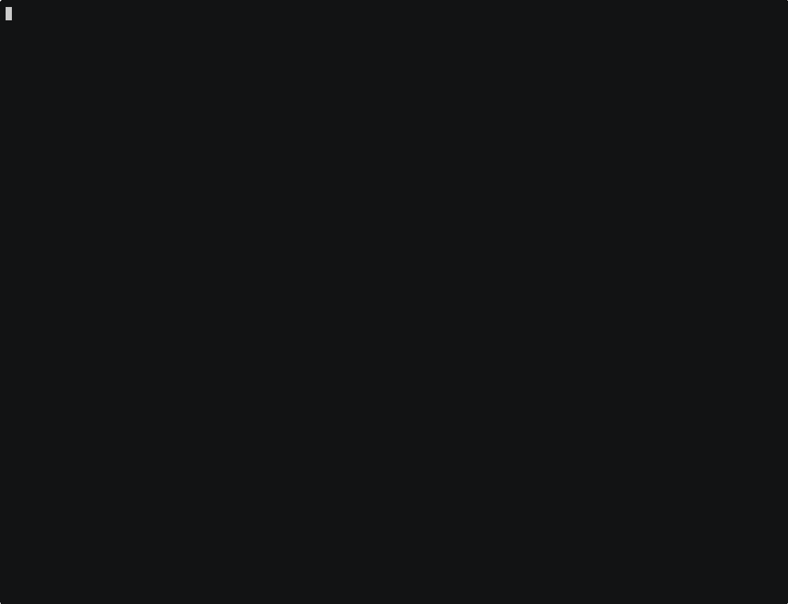

# ASCIIBikes

A 2d remake of the tron style game [Armagetron Advanced](https://www.armagetronad.org/) for the linux terminal.

This game was originally created as part of the university course TDDC77 Object oriented programming at Linköping
University in 2016. I'm backing it up to keep as a memory.

Note: I don't think this was the final version of the code - there should have been some player select, a game over
screen etc. as well I think. However, this is the most recent version I've been able to find.
